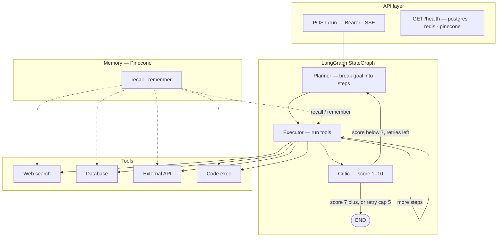

# Multi-Agent AI (LangGraph)

A production-style **multi-agent** system: each request runs a **plan → act → verify** loop (executor steps through the plan; the critic either accepts work or sends control back to the planner). Tool use (search, DB, HTTP, code), **vector memory** (Pinecone), **LLM cascade** (Claude → GPT‑4o → Gemini), **SSE** streaming, and **cooperative cancellation** when the client disconnects.

## Portfolio / live demo

| | |
|---|---|
| **Live URL** | _After deploy (e.g. Render):_ `https://your-service.onrender.com` |
| **Run agent** | `POST /run` — see [Calling `/run`](#calling-run) (requires **Bearer token**) |
| **Access** | Put a line in your resume/README: _“Email me for a demo API token”_ — starts a conversation and avoids exposing secrets in the repo. |

**Security:** Never commit `.env` or real API keys. This repo lists only `.env.example`. `POST /run` is protected by **`API_TOKEN`** (Bearer). `/health` stays unauthenticated so hosting platforms can probe liveness.

## What it does (interview sound bite)

You give a **goal**; a **planner** breaks it into steps; an **executor** runs each step with **tools**; a **critic** scores completeness. If the score is too low, the graph **replans** (cap: 5 critic failures). **Memory** is written only after a **passing** critic score. LLM calls use a **single** `invoke_with_fallback` entry point with **model cascade** and **Redis DLQ** on total failure.

## Architecture

Overview (same layout as the repo diagram under `docs/`):


**API layer**

| Endpoint | Role |
|----------|------|
| `POST /run` | **Bearer** auth; response streams **SSE** |
| `GET /health` | Probes **PostgreSQL**, **Redis**, and **Pinecone** (and reports configured LLM providers). Does not run the graph. |

**LangGraph `StateGraph`**

1. **Planner** — breaks the goal into steps (uses goal + recalled memory).
2. **Executor** — runs **tools** step-by-step until the plan is finished (may loop within the executor while steps remain).
3. **Critic** — scores the outcome **1–10**.
4. If **score is below 7**, flow returns to the **Planner** for revision. If **score is 7 or higher**, the run ends at **END**.
5. **↺ At most 5 critic-driven retries** (`attempt_count`), then **END** regardless of score (see `orchestrator.py`).

**Tools** (invoked from the executor): web search (Tavily), allowlisted **database** SQL, **external HTTP** API calls, **subprocess code** execution.

**Memory (Pinecone):** **recall** at the start of `/run` (context into state); **remember** after a passing critic score.

**LLM & resilience:** single entry `invoke_with_fallback` — model order **Claude → GPT‑4o → Gemini**, **exponential backoff** on transient errors, failed invocations **DLQ’d in Redis** on total failure.

<details>
<summary>Mermaid (text-only equivalent)</summary>



</details>

More on the static asset: [`docs/README.md`](docs/README.md).

## Tech stack

- Python 3.11 · LangGraph · LangChain · FastAPI · SSE  
- LLMs: Anthropic Claude, OpenAI (GPT‑4o + embeddings), Google Gemini  
- Data: PostgreSQL (asyncpg), Redis (cache + DLQ), Pinecone (vectors)  
- Search: Tavily · HTTP: httpx · Containers: Docker / Compose  

## Git repository (important)

The project should be its **own** Git repo (only `ai-agent/`), **not** your Windows user folder.

1. Confirm toplevel: from this directory run `git rev-parse --show-toplevel` — it must print this project path.  
2. If it prints your home directory, remove the mistaken `C:\Users\honey\.git` (that only removes Git metadata, not your files), then:

   ```bash
   cd path/to/ai-agent
   git init
   git add .
   git commit -m "initial commit — multi-agent LangGraph service"
   ```

3. Ensure **`.env` is listed in `.gitignore`** before `git push` (this repo already ignores it).

## Secrets & `.env`

Copy `.env.example` → `.env` and fill in:

- **`API_TOKEN`** — long random string; send `Authorization: Bearer <token>` on `/run`.
- Provider keys: `ANTHROPIC_API_KEY`, `OPENAI_API_KEY`, **`GOOGLE_API_KEY`** (Gemini fallback), `TAVILY_API_KEY`, Pinecone, DB URLs, etc.

## Reproducible installs

In a **dedicated venv**:

```bash
python -m venv .venv
.venv\Scripts\activate
pip install -r requirements.txt
pip freeze > requirements.lock.txt
```

Commit `requirements.lock.txt` when you change dependencies. See comments in `requirements.txt` about ranges vs lockfile.

## Run locally (Docker)

1. Fill `.env` (including **`API_TOKEN`**).
2. Pinecone index: **dimension 1536**, metric **cosine** for `text-embedding-3-small`.
3. `docker compose up --build`
4. `curl http://localhost:8000/health` then call `/run` (with Bearer token).

## Calling `/run`

`POST /run` returns **Server-Sent Events** (`text/event-stream`). Use `-N` with curl so chunks print immediately.

```bash
curl -N -X POST http://localhost:8000/run \
  -H "Authorization: Bearer YOUR_API_TOKEN" \
  -H "Content-Type: application/json" \
  -d "{\"goal\": \"what is 2 + 2, explain your reasoning\"}"
```

Smoke test without extra tools/Tavily; expand goals once the loop is verified.

## Deploy (e.g. Render)

1. Connect this **GitHub** repo to a **Web Service**; use the **Dockerfile** (or build command + start from README if you adapt).  
2. Set **all** environment variables from `.env.example` in the dashboard (including **`API_TOKEN`** and provider keys).  
3. Use the service URL as your **live demo** link. Expect cold starts on free tiers; set **health check** path to `/health`.

## Tests

```bash
pip install -r requirements.txt
python -m pytest
```

Graph tests mock LLMs and memory (no keys). They do **not** hit `POST /run`; add HTTP tests later if you want to assert Bearer behavior end-to-end.

## Client disconnects

`/run` streams LangGraph via a **background task** + queue; on client disconnect the task is **`cancel()`led** so `astream` stops at the next `await`. Pure CPU-bound work inside a node may still run until it yields.

## Operational notes

- **Auth:** `POST /run` requires `Authorization: Bearer <API_TOKEN>`.  
- **Tavily:** `web_search` uses `asyncio.to_thread` around the sync client — fine until very high concurrency.  
- **DB:** Allowlisted SQL only in `db/query_templates.py`.  
- **Code exec:** Subprocess on the host — fine for **local** dev; use **E2B** (or similar) before exposing **untrusted** `/run` to the internet with `run_code` enabled.  

## Layout

- `main.py` — FastAPI, SSE, auth on `/run`
- `utils/llm.py` — LLM cascade + DLQ
- `utils/auth.py` — Bearer verification
- `orchestrator.py` — LangGraph + `MemorySaver`
- `agents/` · `tools/` · `memory/` · `db/`
