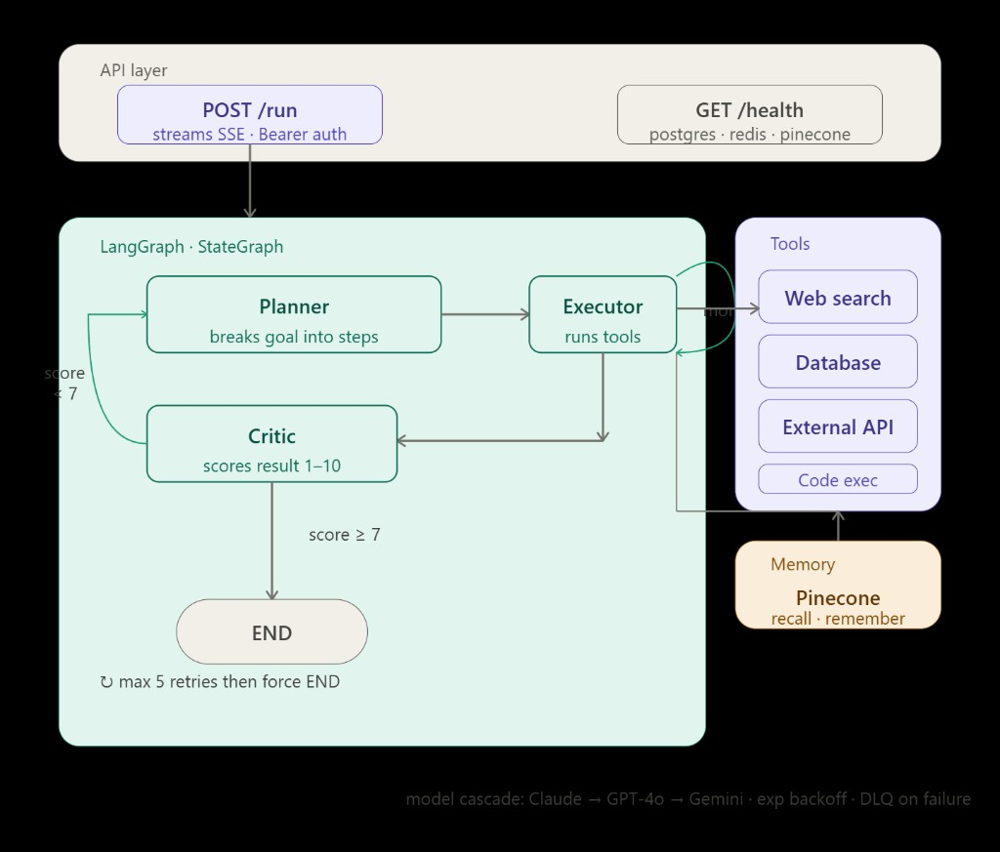
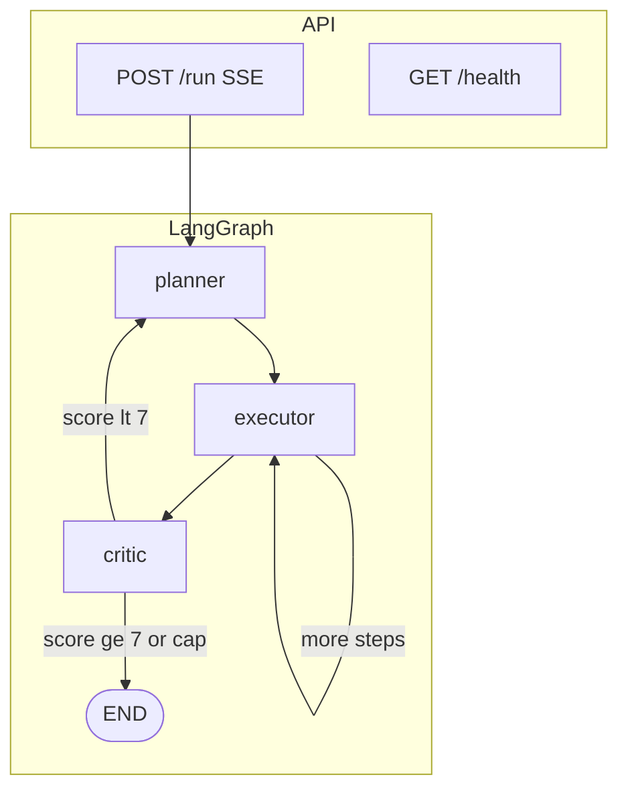

# Multi-Agent AI System

> An AI agent that completes tasks end-to-end give it a goal,  
> it figures out the steps, searches the web, runs tools, checks  
> its own work, and hands you a finished answer.

Most AI tools just answer questions. This one actually *does things* — it plans, executes, and self-corrects in a loop until the result is good enough. Built with LangGraph to orchestrate multiple specialized agents working together.

**Built by [Honey Umasree Pentakota](mailto:honeyumasre01@gmail.com)**

## Live demo

| Link | URL |
|------|-----|
| **Frontend** | [ai-agent-smoky.vercel.app](https://ai-agent-smoky.vercel.app) |
| **API** | [ai-agent-tvpo.onrender.com](https://ai-agent-tvpo.onrender.com) |
| **Health check** | [ai-agent-tvpo.onrender.com/health](https://ai-agent-tvpo.onrender.com/health) |

Want a demo token? Email [honeyumasre01@gmail.com](mailto:honeyumasre01@gmail.com).

## What it does

You give it a goal. The system handles the rest:

- **Planner** — breaks your goal into atomic steps
- **Executor** — runs each step using tools (web search, database, APIs, code execution)
- **Critic** — scores the result 1–10. If the score is below 7, it replans and tries again (max 5 retries)
- **Memory** — saves successful results to Pinecone so future tasks benefit from past context

Results stream back to you live as **Server-Sent Events**.

## Architecture



<details>
<summary>Mermaid (text-only equivalent)</summary>



</details>

See [`docs/README.md`](docs/README.md) for diagram asset notes.

## Tech stack

| Layer | Tech |
|-------|------|
| **Orchestration** | LangGraph (`StateGraph`) |
| **LLMs** | Claude → GPT-4o → Gemini (cascade) |
| **Memory** | Pinecone (vector store) |
| **Tools** | Tavily (search) · asyncpg · httpx |
| **API** | FastAPI · SSE streaming |
| **Cache / DLQ** | Redis |
| **Database** | PostgreSQL |
| **Containers** | Docker · Docker Compose |

## Run locally

### 1. Clone and set up environment

```bash
git clone https://github.com/honeyumasree01/ai-agent.git
cd ai-agent
python -m venv .venv
```

Windows (PowerShell):

```powershell
.venv\Scripts\Activate.ps1
pip install -r requirements.txt
```

macOS / Linux:

```bash
source .venv/bin/activate
pip install -r requirements.txt
```

### 2. Configure environment

```bash
cp .env.example .env
```

Fill in your API keys in `.env` (see `.env.example` for required variables).

### 3. Start with Docker

```bash
docker compose up --build
```

### 4. Test it’s running

```bash
curl http://localhost:8000/health
```

## Call the API

```bash
curl -N -X POST https://ai-agent-tvpo.onrender.com/run \
  -H "Authorization: Bearer YOUR_TOKEN" \
  -H "Content-Type: application/json" \
  -d "{\"goal\": \"what are the top 3 AI tools launched this month\"}"
```

The response streams back in real time — you’ll see planner, executor, and critic events as they happen.

## Run tests

```bash
python -m pytest tests/test_graph.py -v
```

Tests mock LLM and memory calls — no API keys needed to run the suite.

## Project structure

```text
ai-agent/
├── main.py              # FastAPI app, /run and /health
├── orchestrator.py      # LangGraph StateGraph
├── agents/
│   ├── planner.py       # breaks goal into steps
│   ├── executor.py      # runs tools per step
│   └── critic.py        # scores and loops back
├── tools/
│   ├── search.py        # Tavily web search
│   ├── database.py      # allowlisted SQL + Redis cache
│   ├── api.py           # external HTTP calls
│   └── code_exec.py     # subprocess code execution
├── db/
│   └── query_templates.py
├── memory/
│   └── vector_store.py  # Pinecone recall + remember
├── utils/
│   ├── llm.py           # cascade + DLQ hooks
│   ├── llm_clients.py
│   ├── auth.py          # Bearer token verification
│   ├── health.py        # /health probes
│   ├── settings.py
│   ├── retry.py
│   ├── app_context.py   # DB + Redis pools
│   └── errors.py
├── tests/
│   └── test_graph.py
├── frontend/
│   └── index.html       # live UI (deployed on Vercel)
├── docs/
│   └── architecture.png
├── Dockerfile
├── docker-compose.yml
└── .env.example
```

## Security

- `POST /run` requires `Authorization: Bearer <token>` — email for a demo token
- `GET /health` is public for uptime monitoring
- No secrets in this repo — see `.env.example` for required keys
- SQL injection prevented via allowlisted query templates in `db/query_templates.py`

---

Questions or want to see it in action? Reach out at [honeyumasre01@gmail.com](mailto:honeyumasre01@gmail.com).
